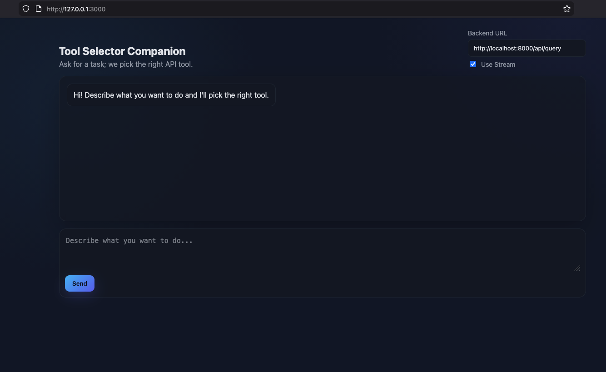
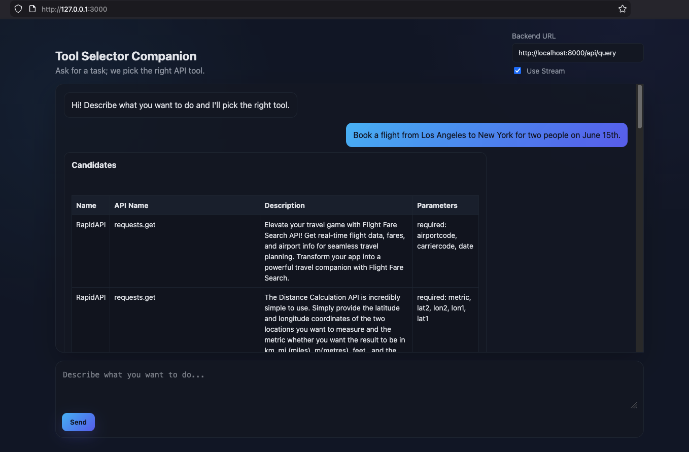
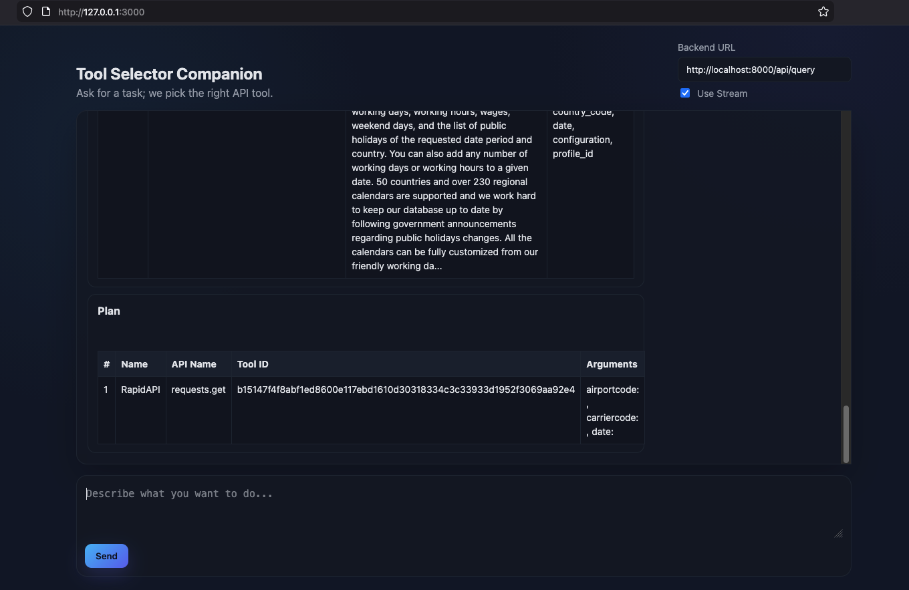
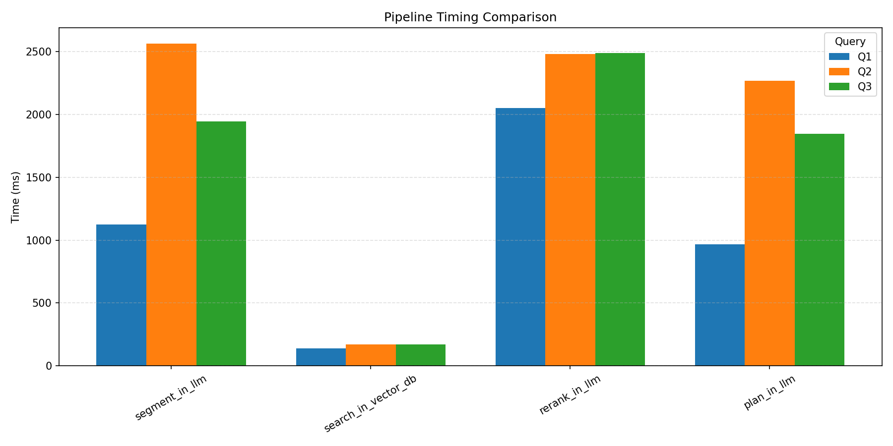

# Tool Selection Pipeline

This repo contains a retrieval-first tool selection system with optional LLM rerank and planning.

Key capabilities
- Deterministic by default: FAISS retrieval with an optional standard-deviation cutoff trims weak candidates before rerank/plan.
- Multi-intent aware: the request is segmented (deterministically or via LLM when enabled) and each segment is searched independently.
- Optional LLM upgrades: OpenAI-based reranker, planner, and segmenter can be toggled via env vars without changing the API surface.
- Streaming-friendly: the FastAPI backend can stream the full JSON payload line by line for a responsive frontend.
- Observability hooks: wrap the client with `request_logging_wrapper` to emit retrieval/rerank/plan traces per request id, and use the evaluation harness to measure recall against Gorilla test sets.

The flow you’ll see in the UI:

1) Landing page (enter your query, pick backend, toggle streaming)

  

2) Send a query (e.g., `Book a flight from LA to NYC on June 15th`) — first response shows the top candidate tools

  

3) Then view the generated plan (steps) for the chosen tool(s)

  

Timing sample (repo env: LLMs enabled)
- Collected with `poetry run python timing/run_timings.py` after building the FAISS index; env from `.env`/`local.env` enables `USE_LLM_CONTEXT_SEGMENTER`, `USE_LLM_RERANK`, and `USE_LLM_PLANNER` (OpenAI models), with retrieval knobs at defaults (`INDEX_DB_RETRIEVAL_COUNT=10`, `RESPONSE_RETRIEVAL_COUNT=5`, std-dev filter on).
- Queries: Q1 asks for a one-way LA→NYC flight; Q2/Q3 add car rental plus coffee shop recommendations, yielding more segments and search fan-out.
- Observed pattern: vector search and LLM rerank/segment dominate as requests become multi-intent, while planning remains light because only top candidates are considered.

  

You may read the detailed documentation:

- [Setup](docs/setup.md) — how to install, configure env vars, and run locally (Poetry) or via Docker.
- [Workflow](docs/workflow.md) — pipeline flow diagram, segmentation strategy, scoring filters, and streaming behavior.
- [Modules](docs/modules.md) — what each module does and why it exists (including logging and evaluation helpers).
- [Design](docs/design.md) — design rationale, retrieval safeguards, and improvements over full-context prompting.
